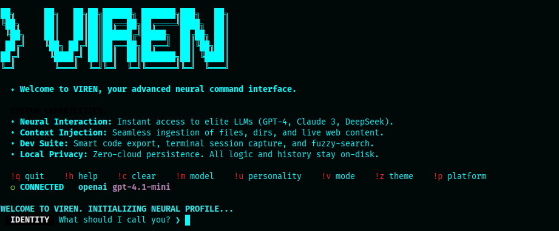

<p align="center">
<pre>
██╗      ██╗   ██╗██╗██████╗ ███████╗███╗   ██╗
╚██╗     ██║   ██║██║██╔══██╗██╔════╝████╗  ██║
 ╚██╗    ██║   ██║██║██████╔╝█████╗  ██╔██╗ ██║
 ██╔╝    ╚██╗ ██╔╝██║██╔══██╗██╔══╝  ██║╚██╗██║
██╔╝      ╚████╔╝ ██║██║  ██║███████╗██║ ╚████║
╚═╝        ╚═══╝  ╚═╝╚═╝  ╚═╝╚══════╝╚═╝  ╚═══╝
</pre>
</p>

# Virtual Enginner

<p align="center"> <strong>The Advanced Neural Command Interface -> which means a specialized AI-driven command-line assistant designed to bridge the gap between natural language intent and complex terminal execution.</strong></p>

<p align="center">
  <strong>Unleashing elite machine intelligence directly into your terminal environment.</strong>
</p>


---

## 1. What is Viren?

**Viren** is a specialized, high-performance Command Line Interface (CLI) built from the ground up in GoLang. It is designed for software engineers, system architects, and researchers who require an immediate, context-aware bridge to the world's most powerful Large Language Models (LLMs) without the friction of a web browser.

Viren is defined by four core pillars:
1.  **Velocity**: A "zero-wait" architecture with sub-100ms startup times.
2.  **Context**: Native ingestion of local source code, documentation, and active terminal sessions.
3.  **Privacy**: A local-first philosophy where your data never touches a "Viren Cloud."
4.  **Ergonomics**: A keyboard-centric design utilizing fuzzy finding and pipe integration.

As the spiritual successor to the **Cha** project, Viren takes the interactive AI experience to its logical conclusion: a tool that is as stable and essential as `git`, `docker`, or `vim`.

---

## 2. Table of Contents

1.  [Overview](#3-overview)
2.  [The Vision](#4-the-vision)
3.  [Core Technical Features](#5-core-technical-features)
4.  [The Neural Difference](#6-the-neural-difference)
5.  [Installation Deep-Dive](#7-installation-deep-dive)
    *   [Linux & macOS](#linux--macos)
    *   [Windows (WSL2)](#windows-wsl2)
    *   [Android (Termux)](#android-termux)
6.  [Quick Start Guide](#8-quick-start-guide)
7.  [Interactive Command Reference](#9-interactive-command-reference)
    *   [Core Commands](#core-commands)
    *   [NEW: AI-Powered Commands](#new-ai-powered-commands-v100)
    *   [Key Improvements](#key-improvements-in-latest-version)
8.  [Advanced Context Ingestion](#10-advanced-context-ingestion)
    *   [Usage Examples](#usage-examples)
9.  [Logic & Behavior](#11-logic--behavior)
    *   [AI Personalities](#ai-personalities)
    *   [Domain Modes](#domain-modes)
10. [Configuration & Personalization](#12-configuration--personalization)
11. [API Platform Integration](#13-api-platform-integration)
12. [Local & Open Source Setup (Ollama)](#14-local--open-source-setup)
13. [Performance Benchmarks](#15-performance-benchmarks)
14. [Comparison: Viren vs. Others](#16-comparison-viren-vs-others)
15. [Development & Building](#17-development--building)
16. [Project Roadmap](#18-project-roadmap)
17. [Privacy & Security Guarantee](#19-privacy--security-guarantee)
18. [Detailed Use Cases](#20-detailed-use-cases)
19. [Troubleshooting Strategy](#21-troubleshooting-strategy)
20. [Contributing](#22-contributing)
21. [Inspired By](#23-inspired-by)
22. [License](#24-license)

---

## 3. Overview

Viren is engineered for the "Flow State." Developers spend their lives in the terminal; switching to a Chrome tab to ask an AI about a specific bug breaks the neural loop of coding. Viren brings the AI to the code.

By leveraging Go's native concurrency and efficient memory management, Viren can handle massive codebases (via the Codedump feature) and inject them into the context window of elite models like Claude 3.5 Sonnet or GPT-4o. It acts as a "Universal API Translator," allowing you to switch between 11+ providers and 40+ specialized logic modes with a single command.

<p align="center">
  
</p>

---

## 4. The Vision

### Normalization of Intelligence
We believe AI should not be a "destination" but a utility. Just as you don't think twice about running `ls` to see files, you shouldn't think twice about running `viren` to refactor a function. Our vision is to make high-level reasoning an invisible layer of the Unix environment.

### The Keyboard-First Era
Web UIs are optimized for engagement and mouse clicks. Viren is optimized for **throughput**. By using fuzzy-selection (`fzf`) for every menu, we ensure that you can change models, themes, or platforms in under 2 seconds without ever moving your hands from the home row.

---

## 5. Core Technical Features

*   **Asynchronous Engine**: Viren uses background goroutines to handle animations, API requests, and terminal rendering simultaneously.
*   **Intelligent Tokenization**: Built-in estimation tools allow you to check the "weight" of a file before sending to the AI.
*   **ANSI UI Framework**: A custom-built rendering engine providing high-fidelity borders, boxes, and syntax highlighting.
*   **Session Persistence**: Every conversation is serialized to a local JSON database.
*   **Dynamic Logic Injection**: Viren modifies the "System Prompt" in real-time based on your selection.
*   **AI-Powered Analysis**: All context ingestion commands (`!d`, `!l`, `!x`, `!s`, `!w`, `!git`) automatically trigger AI analysis.
*   **Code Operations Suite**: Built-in commands for explaining, testing, documenting, optimizing, and translating code.
*   **File Comparison**: Compare multiple files with AI-powered diff analysis.
*   **Smart Regeneration**: Regenerate AI responses without retyping prompts.
*   **🆕 Auto-Update System**: Self-updating with resume capability, progress display, and backup/restore.
*   **🆕 Resume Downloads**: Interrupted downloads automatically resume from checkpoint.
*   **🆕 Release Notes Display**: Shows "What's New" after each update with feature highlights.
*   **🆕 Enhanced Help System**: Beautiful help display with latest features prominently shown.
*   **🆕 Full Config Customization**: Every command key can be rebound in config.

---

## 6. The Neural Difference

What separates Viren from a simple "Chat-with-API" script?

### Contextual Awareness
Viren "sees" your environment. When you use the **Shell Record (`!x`)** feature, Viren opens a sub-process, watches your terminal output, and captures errors that normally would require manual copy-pasting.

### Zero Cloud Dependency
Viren does not have a backend. Your requests go directly from your local binary to the AI provider.

---

## 7. Installation Deep-Dive

### Linux & macOS (Automated Script)
The recommended way to install Viren on Unix systems is via our production-ready shell script.

```bash
curl -sSL https://raw.githubusercontent.com/fraol163/viren/main/install.sh | bash
```

### Windows (WSL2)
Viren is fully supported on Windows via the **Windows Subsystem for Linux (WSL2)**. This provides a native, high-performance environment where Viren's advanced Unix features (like shell recording and fuzzy-finding) work flawlessly.

#### 1. Setup WSL2
If you haven't already, enable WSL2 and install a Linux distribution (we recommend **Ubuntu**):
1.  Open **PowerShell** as Administrator.
2.  Run the command: `wsl --install`.
3.  Restart your computer if prompted.
4.  Launch your Linux distribution from the Start Menu and complete the initial user setup.

#### 2. Install Viren
Open your WSL2 terminal (e.g., Ubuntu) and run the standard installation command:
```bash
curl -sSL https://raw.githubusercontent.com/fraol163/viren/main/install.sh | bash
```

#### 3. Why WSL2?
Unlike a native `.exe`, the WSL2 method ensures:
- **Full Compatibility**: Direct access to Linux-native tools like `fzf` and `yt-dlp`.
- **Performance**: High-speed file system operations for large project dumps (`!d`).
- **Security**: Your AI history and configuration remain isolated within the secure Linux environment.

### Android (Termux)
1. Install Termux.
2. Run the Linux installation script. Viren detects Termux and disables CGO for maximum compatibility.
3. First you must update and upgrade dependencies 

---

## 8. Quick Start Guide

1.  **Install**: Run the installation steps above.
2.  **Configure**: Set your API key: `export OPENAI_API_KEY="your-key"` (PowerShell: `$env:OPENAI_API_KEY="your-key"`).
3.  **Launch**: Type `viren`.
4.  **Onboard**: Enter your name and role.
5.  **Chat**: Type your first query.

---

## 9. Interactive Command Reference

Inside the `viren` shell, use these "Bang Commands":

### Core Commands

| Command | Category | Functional Capability |
| :--- | :--- | :--- |
| `!q` | Session | **Quit**: Safely exits and saves your history. |
| `!h` | UI | **Help**: Opens the interactive dashboard. |
| `!c` | Context | **Clear**: Wipes the screen and context. |
| `!m` | Logic | **Model**: Switch between LLMs. |
| `!p` | Logic | **Platform**: Switch between providers. |
| `!u` | Tone | **Personality**: Switch between 7 AI personas. |
| `!v` | Logic | **Mode**: Apply specialized domain prompts. |
| `!z` | UI | **Theme**: Instantly change colors. |
| `!e` | Export | **Export**: Export chat history or code blocks. |
| `!b` | Session | **Backtrack**: Return to previous conversation point. |
| `!a` | Session | **History**: Browse/restore conversations. |
| `!y` | Clipboard | **Copy**: Copy response to clipboard. |
| `cc` | Clipboard | **Quick Copy**: Copy latest response. |
| `!d` | Ingestion | **Codedump**: Bundle project for review. |
| `!x` | Ingestion | **Shell Record**: Capture terminal output or run command. |
| `!l` | Ingestion | **Load**: Inject specific files (Go, Py, PDF, etc.). |
| `!s` | Ingestion | **Scrape**: Feed a website URL to the AI. |
| `!w` | Ingestion | **Web Search**: Live search via Brave. |
| `!t` | Editor | **Text Editor**: Open advanced editor mode. |
| `\` | Input | **Multi-line**: Enter multi-line input mode. |

### NEW: AI-Powered Commands (v1.0.0+)

| Command | Category | Functional Capability | Example |
| :--- | :--- | :--- | :--- |
| `!r` | AI | **Regenerate**: Regenerate last AI response | `!r` |
| `!explain` | AI | **Explain Code**: Step-by-step code explanation | `!explain` |
| `!summarize` | AI | **Summarize**: Summarize content with key points | `!summarize` |
| `!test` | AI | **Generate Tests**: Create unit tests for code | `!test` |
| `!doc` | AI | **Generate Docs**: Create documentation for code | `!doc` |
| `!optimize` | AI | **Optimize Code**: Improve performance & readability | `!optimize` |
| `!git` | Integration | **Git + AI**: Run git commands with AI analysis | `!git diff` |
| `!compare` | AI | **Compare Files**: Compare multiple files | `!compare file1.go file2.go` |
| `!translate` | AI | **Translate Code**: Convert to another language | `!translate python` |
| `!f` | AI | **Find/Replace**: Find and replace in code | `!f /old/new/` |
| `!cmd` | Reference | **Command Reference**: Show all commands with examples | `!cmd` |

### Key Improvements in Latest Version

- **All context commands now include AI analysis** - When you use `!d`, `!l`, `!x`, `!s`, or `!w`, Viren now automatically analyzes the content and provides insights
- **Visible processing** - See what's being scraped, loaded, or searched before AI responds
- **Loading animations** - Clear indicators showing what the AI is doing (scraping, analyzing, comparing, etc.)
- **Enhanced error handling** - Clear, actionable error messages for all commands
- **Customizable command keys** - All commands can be rebound in `~/.viren/config.json`
- **🆕 Auto-Update System** - Viren checks for updates on startup and can update itself with `!update`
  - Automatic update notifications
  - Resume capability for interrupted downloads
  - Backup and restore on failure
  - Configurable auto-update checks

---

## 10. Advanced Context Ingestion

### Codedump Protocol (`!d`)
Automatically bundles your source code while respecting `.gitignore`. Perfect for architectural reviews or finding project-wide bugs.

### Usage Examples

```bash
# Start interactive chat
viren

# Ask a question directly
viren "How do I implement a binary search tree in Go?"

# Continue last session
viren -c

# Search history and load session
viren -a

# Dump codebase for analysis
viren -d ./src

# Load files and ask questions
viren -l main.go "Explain this code"

# Web search with AI analysis
viren -w "Go best practices"

# Scrape URL and analyze
viren -s https://golang.org/doc/tutorial

# Export code blocks from last response
viren -e

# Pipe input to Viren
cat error.log | viren "Find the root cause"

# Use specific platform and model
viren -p groq -m llama3 "Write a REST API"

# Set platform and model in one flag
viren -o "groq|llama3" "Hello in Go"

# Estimate tokens in a file
viren -t main.go

# Show version
viren -v

# Clear session files
viren --clear
```

### In-Chat Examples

```
!d              # Dump current directory codebase
!l ./config     # Load all config files
!s https://example.com  # Scrape and analyze website
!w Go concurrency patterns  # Search and analyze
!git diff       # Analyze git diff with AI
!test           # Generate tests for loaded code
!doc            # Generate documentation
!optimize       # Optimize loaded code
!explain        # Explain code step-by-step
!compare main.go main_old.go  # Compare files
!translate python  # Translate code to Python
!f /old/new/    # Find and replace in code
!r              # Regenerate last response
!cmd            # Show all commands with examples
```

---

## 11. Logic & Behavior

Viren allows you to precisely tune how the AI thinks and speaks through Personalities and Domain Modes.

### AI Personalities
Switch using `!u`. Each personality alters the tone, verbosity, and style of the AI.
- **Analytical**: Logical, systematic, and data-driven.
- **Creative**: Artistic, imaginative, and metaphor-heavy.
- **Focused**: Goal-oriented, concise, and productivity-focused.
- **Empathetic**: Emotionally intelligent and supportive.
- **Playful**: Fun, energetic, and full of wit.
- **Balanced**: Versatile and adaptive (Default).
- **Rick Sanchez**: Cynical, sarcastic, and unhinged (Rick and Morty style).

### Domain Modes
Switch using `!v`. Each mode applies a heavy system mandate for specific technical tasks.
- **Standard**: Professional balanced tone.
- **Zenith**: Advanced reasoning with cosmic metaphors.
- **Code Whisperer**: Expert refactoring and idiomatic patterns.
- **Socratic**: Never gives direct answers; leads you through questions.
- **Complexity Analyzer**: Calculates Big-O time and space complexity.
- **DSA Mode**: Data Structures & Algorithms specialist.
- **CyberSec**: Security audit and penetration testing focus.
- **... and 30+ more** (Physics, Chemistry, Finance, Marketing, etc.)

---

## 12. Configuration & Personalization

Settings are stored in `~/.viren/config.json`.

### Configurable Options

**All commands can be rebound!** Edit `~/.viren/config.json`:

*   **Core Commands**: `exit_key`, `help_key`, `clear_history`, `model_switch`, `platform_switch`
*   **UI Commands**: `mode_switch` (!v), `theme_switch` (!z), `personality_switch` (!u)
*   **Export/Import**: `export_chat`, `copy_to_clipboard`, `quick_copy_latest`
*   **Context Loading**: `load_files` (!l), `code_dump` (!d), `shell_record` (!x)
*   **Web Features**: `web_search` (!w), `scrape_url` (!s)
*   **Session Mgr**: `answer_search` (!a), `backtrack` (!b)
*   **AI Commands**: `regenerate` (!r), `explain_code` (!explain), `summarize` (!summarize)
*   **Code Ops**: `generate_tests` (!test), `generate_docs` (!doc), `optimize_code` (!optimize)
*   **Integration**: `git_command` (!git), `compare_files` (!compare), `translate_code` (!translate)
*   **Utilities**: `find_replace` (!f), `command_reference` (!cmd), `editor_input` (!t), `onboarding` (!onboard), `update_command` (!update), `all_models` (!o)
*   **Other**: `multi_line` (\\), `preferred_editor`
*   **Update System**: `auto_update` (true/false), `update_command` (!update), `last_update_check` (timestamp)

### Complete Config Example

```json
{
  "exit_key": "!q",
  "help_key": "!h",
  "clear_history": "!c",
  "model_switch": "!m",
  "platform_switch": "!p",
  
  "mode_switch": "!v",
  "theme_switch": "!z",
  "personality_switch": "!u",
  "onboarding": "!onboard",
  
  "regenerate": "!r",
  "explain_code": "!explain",
  "summarize": "!summarize",
  "generate_tests": "!test",
  "generate_docs": "!doc",
  "optimize_code": "!optimize",
  
  "git_command": "!git",
  "compare_files": "!compare",
  "translate_code": "!translate",
  "find_replace": "!f",
  "command_reference": "!cmd",
  
  "load_files": "!l",
  "code_dump": "!d",
  "shell_record": "!x",
  "web_search": "!w",
  "scrape_url": "!s",
  "answer_search": "!a",
  "backtrack": "!b",
  "export_chat": "!e",
  "editor_input": "!t",
  
  "current_platform": "openai",
  "current_model": "gpt-4.1-mini",
  "current_theme": "deepspace",
  "enable_session_save": true,
  "mute_notifications": false,
  "auto_update": true
}
```

---

## Auto-Update System

Viren includes a built-in self-update mechanism that keeps your installation current without manual reinstallation.

### How It Works

1. **Automatic Check**: On startup, Viren checks GitHub for new releases (once per day)
2. **Notification**: If an update is available, you'll see a notification box
3. **Manual Trigger**: Type `!update` anytime to check and install updates
4. **Download**: Updates are downloaded with progress display
5. **Install**: Binary is replaced atomically with backup protection
6. **Resume**: Failed downloads resume automatically on next `!update`

### Features

- **Resume Capability**: Interrupted downloads resume from where they left off
- **Error Handling**: Network failures, timeouts, and interruptions are handled gracefully
- **Backup & Restore**: Original binary is backed up and restored if installation fails
- **Progress Display**: Real-time download progress with percentage and size
- **Configurable**: Disable auto-checks with `"auto_update": false` in config

### Usage

```bash
# Manual update check and install
viren
!update

# Disable auto-update checks
# Edit ~/.viren/config.json:
{
  "auto_update": false
}
```

### Error Recovery

If an update fails:
- **Network error**: Run `!update` again - download will resume
- **Installation error**: Original binary is automatically restored
- **Partial download**: Deleted after 24 hours to save space

---

## 13. API Platform Integration

Viren supports OpenAI, Brave, OpenRouter, Gemini, Anthropic, DeepSeek, Groq, xAI, Mistral, Together AI, and AWS Bedrock. See [docs/api_keys.md](./docs/api_keys.md) for full setup details.

---

## 14. Local & Open Source Setup

Viren is a bridge to local LLMs via **Ollama**.
1. Install Ollama.
2. In Viren, type `!p ollama`.
3. Reasoning happens entirely on your local hardware.

---

## 15. Performance Benchmarks

Viren starts in under 100ms and can scan 1,000 code files in under 400ms.

---

## 16. Comparison: Viren vs. Others

Viren is faster than Python-based tools and more context-aware than standard web interfaces.

---

## 17. Development & Building

### Prerequisites
- **Go**: 1.21+
- **FZF**: Required for menus.

```bash
# Build from source
make build

# Or directly
go build -o viren ./cmd/viren
```

---

## 18. Project Roadmap

### ✅ Completed (v1.0.0+)
- ✅ All original commands fixed and enhanced
- ✅ AI-powered analysis for all context commands (`!d`, `!l`, `!x`, `!s`, `!w`, `!git`)
- ✅ 11 new AI commands (!r, !explain, !test, !doc, !optimize, !git, !compare, !translate, !f, !summarize, !cmd)
- ✅ Visible processing with loading animations
- ✅ Enhanced error handling
- ✅ Customizable command keys (all commands rebindable)
- ✅ **Auto-Update System** with resume capability
- ✅ **Release Notes Display** after updates
- ✅ **Enhanced Help System** with feature highlights
- ✅ **Network Failure Recovery** for downloads
- ✅ **Backup & Restore** on update failure
- ✅ **Progress Display** for all operations

### Phase 2 (In Progress)
- Llama.cpp integration for local inference
- Multimodal (image) ingestion and analysis
- Voice input support
- Plugin system for custom commands
- Update channels (stable/beta/nightly)

### Future Plans
- Real-time collaboration features
- Cloud sync (optional, privacy-focused)
- Mobile app (iOS/Android)
- VS Code extension
- SSH remote server mode

---

## 19. Privacy & Security Guarantee

Viren is data-transparent. We do not have servers. Your data stays on your disk.

- **No Cloud**: All requests go directly from your machine to the AI provider
- **Local Storage**: Chat history stored in `~/.viren/` and temp files
- **No Tracking**: No analytics, no telemetry, no user tracking
- **Open Source**: All code is auditable on GitHub

---

## 20. Detailed Use Cases

### Code Development
- **Project Auditing**: `!d` to dump codebase, get architectural analysis
- **Bug Hunting**: `!l file.go` to load files, `!explain` to understand issues
- **Code Generation**: Ask Viren to write functions, tests, or entire modules
- **Refactoring**: `!optimize` to improve existing code
- **Documentation**: `!doc` to generate docs for any code

### Learning & Research
- **Web Research**: `!w` to search and analyze topics
- **Code Explanation**: `!explain` to understand complex code
- **File Comparison**: `!compare` to see differences between versions
- **Translation**: `!translate` to convert code between languages

### DevOps & System Admin
- **Git Analysis**: `!git diff/log/status` with AI explanations
- **Log Analysis**: Pipe logs to Viren for root cause analysis
- **Shell Automation**: `!x` to record and analyze shell sessions

---

## 21. Troubleshooting Strategy

### Common Issues

**"No API key set"**
```bash
export OPENAI_API_KEY="your-key"
# Or for other platforms:
export GROQ_API_KEY="your-key"
export ANTHROPIC_API_KEY="your-key"
```

**"fzf not found"**
```bash
# Install fzf
brew install fzf          # macOS
sudo apt install fzf      # Linux
choco install fzf         # Windows (Chocolatey)
```

**"Command not working"**
- Check if you're in interactive mode (type `viren` first)
- Use `!cmd` to see all available commands
- Check `~/.viren/config.json` for custom key bindings

**"No search results"**
- Ensure `BRAVE_API_KEY` is set for web search
- Check your internet connection

**Build Errors**
```bash
# Ensure Go 1.21+
go version

# Clean and rebuild
go clean
go build -o viren ./cmd/viren
```

---

## 22. Contributing

We welcome pull requests for new domain modes and platform adapters. See [CONTRIBUTING.md](./docs/contributing.md).

---

## 23. Inspired By

Viren is the spiritual successor to the **Cha** project, originally created by [Mehmetmhy](https://github.com/mehmetmhy). Viren takes the interactive experience to a professional engineering standard.

---

## 24. License

Viren is released under the **MIT License**.

---

<p align="center">
  <strong>Built with precision by developers, for developers.</strong>
</p>
